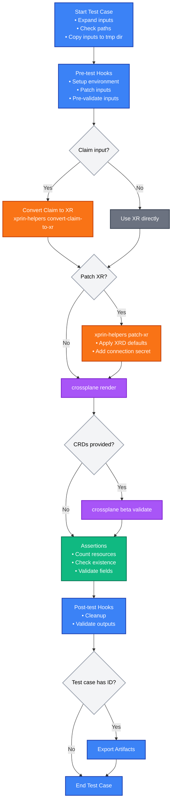

# xprin

A Crossplane testing framework that leverages `crossplane render` and `crossplane beta validate` commands to test if Compositions render correctly against Claims or XRs, and if the rendered manifests validate against their schemas.

## Features

- **Version Agnostic**: Works with any Crossplane CLI version and supports any Composition and Function implementation
- **Local Testing**: Runs entirely locally with no running Kubernetes cluster required. Only requires a running Docker daemon for Composition Functions
- **Multiple Input Types**: Supports both XR (Composite Resource) and Claim inputs
- **XR Patching**: Apply patches on the inputs
- **Template Variables**: Dynamic content using Go template syntax
- **Hooks Support**: Pre-test and post-test shell command execution
- **Assertions**: Validate rendered resources with declarative assertions (count, existence, field checks)
- **Test Chaining**: Export testcase outputs as artifacts for use in follow-up tests to better emulate the reconciliation process
- **CI/CD Ready**: Easy integration into any system or pipeline

## How it works

When xprin runs a test case, it follows this specific sequence:

1. **Pre-test hooks** - Execute any pre-test hooks defined in the test case
2. **Convert Claim to XR** (optional) - If using a Claim input, convert it to XR using `xprin-helpers convert-claim-to-xr`
3. **Patch XR** (optional) - Apply patches (XRD defaults, connection secrets) using `xprin-helpers patch-xr`
4. **Crossplane render** - Run `crossplane render` with the XR, Composition, and Functions
5. **Crossplane validate** (optional) - If CRDs are provided, run `crossplane beta validate` on the rendered output
6. **Assertions** (optional) - Validate rendered resources using declarative assertions (count, existence, field type/value checks)
7. **Post-test hooks** - Execute any post-test hooks defined in the test case
8. **Export artifacts** (optional) - If test case has an `id`, copy outputs to artifacts directory for cross-test references

Visual flow diagram:



The flow ensures that:
- Pre-test hooks can set up the environment, patch inputs or validate them before processing
- Claims are automatically converted to XRs for compatibility with `crossplane render`
- XRs can be enhanced with defaults and connection secrets before rendering
- The rendered output is validated against schemas if CRDs are available
- Assertions validate rendered resources declaratively (count, existence, field checks) after validation
- Post-test hooks can clean up and perform additional validation after assertions
- Test outputs can be exported as artifacts (when `id` is set) and referenced by later tests via `.Tests.{test-id}` template variables for test chaining

## Documentation

- [Installation](docs/installation.md) & (Optional) [Configuration](docs/configuration.md)
- [Getting Started](docs/getting-started.md)
- [Examples](examples/README.md) - Step-by-step examples with real outputs
- [Test Suite Specification](docs/testsuite-specification.md) - Complete reference for all test suite fields and options
- [Assertions](docs/assertions.md) - Complete guide to declarative resource validation
- [How It Works](docs/how-it-works.md) - Deep dive into how xprin works

## Commands

```bash
# Test Compositions
xprin test <targets>

# Check dependencies and configuration
xprin check

# Show version
xprin version
```

## Related Tools

**[xprin-helpers](docs/xprin-helpers.md)**: Helper utilities for converting Claims to XRs and patching XRs
  - [convert-claim-to-xr](docs/xprin-helpers/convert-claim-to-xr.md): Convert Claims to XRs
  - [patch-xr](docs/xprin-helpers/patch-xr.md): Apply patches to XRs

## Requirements

See [Installation & Setup](docs/installation.md#prerequisites) for detailed requirements. At minimum: Crossplane CLI, Docker daemon, and Go 1.24+.

## License

[Apache 2.0](LICENSE)
