# How It Works

This document provides a deep dive into how xprin works under the hood, including execution flow, error handling, and internal mechanics.

## High-Level Execution Flow

At its core, xprin executes test cases through a series of sequential phases:


**Phase Overview:**
1. **Setup** - Expand inputs, resolve paths, copy to temp directory, execute pre-test hooks, convert Claims to XRs
2. **Patch** - Apply XRD defaults and connection secrets to XRs
3. **Render** - Execute `crossplane render` to generate manifests
4. **Validate** - Execute `crossplane beta validate` (if CRDs provided)
5. **Assert** - Run declarative assertions on rendered resources
6. **Finish** - Execute post-test hooks, export artifacts (if test has ID)

## Detailed Execution Flow

The complete execution flow includes decision points and optional steps:

```mermaid
flowchart TD
    A["Start Test Case<br/>• Expand inputs<br/>• Check paths<br/>• Copy inputs to tmp dir"] --> B["Pre-test Hooks<br/>• Setup environment<br/>• Patch inputs<br/>• Pre-validate inputs"]
    B --> C{"Claim input?"}
    C -->|Yes| D["Convert Claim to XR<br/>xprin-helpers convert-claim-to-xr"]
    C -->|No| E["Use XR directly"]
    D --> F{"Patch XR?"}
    E --> F
    F -->|Yes| G["xprin-helpers patch-xr<br/>• Apply XRD defaults<br/>• Add connection secret"]
    F -->|No| I["crossplane render"]
    G --> I
    I --> J{"CRDs provided?"}
    J -->|Yes| K["crossplane beta validate"]
    J -->|No| L["Assertions<br/>• Count resources<br/>• Check existence<br/>• Validate fields"]
    K --> L
    L --> M["Post-test Hooks<br/>• Cleanup<br/>• Validate outputs"]
    M --> N{"Test case has ID?"}
    N -->|Yes| O["Export Artifacts"]
    N -->|No| P["End Test Case"]
    O --> P

    %% Color scheme: Group related operations with white text for readability
    classDef xprin fill:#3b82f6,stroke:#1e40af,stroke-width:2px,color:#fff
    classDef xprinHelpers fill:#f97316,stroke:#c2410c,stroke-width:2px,color:#fff
    classDef crossplane fill:#a855f7,stroke:#7e22ce,stroke-width:2px,color:#fff
    classDef validation fill:#10b981,stroke:#047857,stroke-width:2px,color:#fff
    classDef neutral fill:#6b7280,stroke:#374151,stroke-width:2px,color:#fff
    classDef decision fill:#f3f4f6,stroke:#9ca3af,stroke-width:2px,color:#000

    class A,B,M,O,P xprin
    class D,G xprinHelpers
    class I,K crossplane
    class L validation
    class E neutral
    class C,F,J,N decision
```



## Phase-by-Phase Breakdown

### Phase 1: Setup

**What happens:**
1. **Input Expansion**: Template variables (e.g., `{{ .Repositories.myrepo }}`) are expanded using Go templates
2. **Path Resolution**: All input paths are resolved (absolute, relative to test suite file, or template-based)
3. **Path Verification**: All required files are checked for existence
4. **Temp Directory Creation**: A temporary directory is created for the test case execution
5. **File Copying**: All input files are copied to the temp directory (inputs are never modified in place)
6. **Pre-test Hooks**: All pre-test hooks are executed sequentially in the temp directory (can modify copied files)
7. **Claim to XR Conversion** (if using Claim input): If a Claim is provided instead of an XR, it is converted to an XR using `xprin-helpers convert-claim-to-xr`. The converted XR is written to the temp directory and used for subsequent phases.

**Template Variables Available:**
- `{{ .Inputs.XR }}` - Path to XR file (only available if XR is provided directly; **not available in pre-test hooks when using Claim input**, as conversion happens after hooks)
- `{{ .Inputs.Claim }}` - Path to Claim file (if using Claim input)
- `{{ .Inputs.Composition }}` - Path to Composition file
- `{{ .Inputs.Functions }}` - Path to Functions directory
- `{{ .Repositories.name }}` - Repository paths from configuration
- `{{ .Tests.{test-id}.Outputs.* }}` - Cross-test references (for tests with IDs)

**Key Points:**
- All operations happen in an isolated temp directory
- Input files are never modified in their original location
- Pre-test hooks can modify files in the temp directory
- If any pre-test hook fails, the test fails immediately

### Phase 2: Patch (Optional)

**What happens:**
1. **XR Detection**: Determine if XR patching is needed (based on `patches` configuration)
2. **XRD Defaults**: If `xrd` path is provided, apply XRD defaults to the XR
3. **Connection Secret**: If `connection-secret: true`, set the `spec.writeConnectionSecretToRef` field in the XR (does not create the secret itself, just configures where Crossplane should write it)

**XR Patching Details:**
- Uses `xprin-helpers patch-xr` tool
- XRD defaults are applied by reading the XRD and extracting default values
- Connection secret reference is set in `spec.writeConnectionSecretToRef` with configurable name and namespace (the secret itself is not created, only the reference field is set)
- Patched XR replaces the original in the temp directory

**Alternative Patching via Pre-test Hooks:**
- Pre-test hooks (executed in Phase 1) can also be used for patching XR, Composition, or other input files
- Pre-test hooks operate on the copied files in the temp directory, allowing you to modify them before the formal patching phase
- This is useful for advanced patching scenarios that go beyond XRD defaults and connection secrets
- If both pre-test hook patching and `patches` configuration are used, pre-test hooks run first (in Phase 1), followed by the formal patching phase (Phase 2)

**When it runs:**
- Only if `patches` section is defined (in `common` or test case level)
- Test case level patches override common patches
- If no patches are defined, this phase is skipped

### Phase 3: Render

**What happens:**
1. **Command Execution**: Runs `crossplane render` with:
   - XR (or patched XR) from temp directory
   - Composition file
   - Functions directory
   - Optional context files, context values, observed resources, extra resources, function credentials
2. **Output Capture**: Rendered manifests are written to a file in the temp directory
3. **Resource Parsing**: Rendered output is parsed to extract individual resources
4. **Resource Indexing**: Resources are indexed by `Kind/name` for later reference

**Output Files:**
- `{{ .Outputs.Render }}` - Full rendered output (all resources in one file)
- `{{ .Outputs.Rendered "Kind/name" }}` - Individual resource files (one per resource)

**Error Handling:**
- If `crossplane render` fails, the test fails **immediately**
- No subsequent phases (validate, assertions, post-test hooks) are executed
- This is a hard failure because without rendered output, nothing else can proceed

### Phase 4: Validate (Optional)

**What happens:**
1. **CRD Check**: If `crds` are provided in inputs, validation proceeds
2. **Command Execution**: Runs `crossplane beta validate` with:
   - Rendered output from Phase 3
   - CRD paths provided in inputs
3. **Output Capture**: Validation results are written to a file
4. **Result Parsing**: Validation output is parsed to determine success/failure

**Output Files:**
- `{{ .Outputs.Validate }}` - Validation output file

**Error Handling:**
- If `crossplane beta validate` fails, the test **continues** to assertions and post-test hooks
- Validation failures are collected and reported at the end
- This allows assertions to run even if validation fails, enabling better debugging

**When it runs:**
- Only if `crds` are provided in inputs
- If no CRDs are provided, this phase is skipped and execution proceeds directly to assertions

### Phase 5: Assert

**What happens:**
1. **Assertion Execution**: All assertions are executed sequentially
2. **Resource Loading**: For each assertion, the relevant rendered resources are loaded
3. **Evaluation**: Each assertion is evaluated against the rendered resources
4. **Result Collection**: All assertion results (pass/fail) are collected

**Assertion Types:**
- **Count**: Validates total number of rendered resources
- **Exists**: Checks if a specific resource exists (format: `Kind/name`)
- **NotExists**: Checks if a resource does not exist (format: `Kind/name` or `Kind`)
- **FieldType**: Validates field type (`string`, `number`, `boolean`, `array`, `object`, `null`)
- **FieldExists**: Checks if a field exists at a given path
- **FieldNotExists**: Checks if a field does not exist at a given path
- **FieldValue**: Validates field value using operators (`==`, `is`)

**Error Handling:**
- All assertions are evaluated even if some fail
- Failed assertions are collected and reported at the end
- If assertions fail, the test **continues** to post-test hooks
- This allows cleanup and additional validation even when assertions fail

**Resource Access:**
- Assertions access rendered resources from the temp directory
- Resources are identified by `Kind/name` format
- Field paths use dot notation (e.g., `spec.replicas`, `metadata.labels.app`)

### Phase 6: Finish

**What happens:**
1. **Post-test Hooks**: All post-test hooks are executed sequentially
2. **Artifact Export** (if test has ID): Outputs are copied to artifacts directory
3. **Cleanup**: Temp directory is cleaned up (unless debug mode)

**Template Variables Available:**
- All input variables (same as pre-test hooks)
- `{{ .Outputs.XR }}` - Path to XR file
- `{{ .Outputs.Render }}` - Path to full rendered output
- `{{ .Outputs.Validate }}` - Path to validation output (if validation ran)
- `{{ .Outputs.RenderCount }}` - Number of rendered resources
- `{{ index .Outputs.Rendered "Kind/Name" }}` - Individual resource paths
- `{{ .Tests.{test-id}.Outputs.* }}` - Cross-test references

**Artifact Export:**
- Only happens if test case has an `id` field
- All outputs are copied to a shared artifacts directory
- Artifacts are organized by test ID: `artifacts/{test-id}/`
- Artifacts are available to subsequent tests via `.Tests.{test-id}.Outputs.*`
- Artifacts directory is cleaned up after all tests complete

**Error Handling:**
- Post-test hooks always run, even if previous phases failed
- This ensures cleanup can happen regardless of test outcome
- Hook failures are collected and reported

## Error Handling Behavior

xprin follows a specific error handling strategy that balances immediate failure detection with comprehensive error collection:

### Hard Failures (Immediate Stop)

These failures cause the test to fail immediately, skipping all subsequent phases:

1. **Setup Phase Failures:**
   - Path expansion/verification failures
   - Pre-test hook failures
   - Claim to XR conversion failures

2. **Render Phase Failures:**
   - `crossplane render` command failures
   - Render output parsing failures

**Rationale:** Without successful setup or render output, subsequent phases cannot proceed meaningfully.

### Soft Failures (Continue Execution)

These failures are collected and reported, but execution continues:

1. **Validate Phase Failures:**
   - `crossplane beta validate` command failures
   - Schema validation errors

2. **Assert Phase Failures:**
   - Failed assertions (count, existence, field checks)

**Rationale:** Continuing execution allows:
- Assertions to run even when validation fails (better debugging)
- Post-test hooks to run for cleanup
- All errors to be collected and reported together

### Error Collection and Reporting

- All errors are collected throughout execution
- Errors are reported at the end of test execution
- Verbose mode (`-v`) shows detailed error messages
- Debug mode (`--debug`) shows even more detail

## Common vs Test-Level Configuration

xprin supports defining configuration at two levels: `common` (shared across all tests) and test case level (specific to a test).

### Merging Logic

1. **Common Configuration**: Applied to all test cases in the suite
2. **Test Case Configuration**: Overrides common configuration for that specific test
3. **Field-Level Replacement**: For all fields (including maps like `inputs.context-files`, `inputs.context-values`), if a test case specifies a field, it completely replaces the common value for that field. There is no deep merging of map keys - the entire field value is replaced.
4. **List Replacement**: For lists (like `hooks.pre-test`, `assertions`), test case lists replace common lists (no merging)

### Precedence Rules

- Test case level **always** overrides common level
- If a test case specifies a field (even if it's a map), the entire field value is replaced (not merged)
- For maps like `context-files` and `context-values`, if the test case map is empty, common values are used; if the test case map has any keys, it completely replaces the common map
- For hooks and assertions, test case lists completely replace common lists (they don't append)

### Example

```yaml
common:
  inputs:
    functions: /common/functions
    crds:
      - /common/crds
  hooks:
    pre-test:
      - name: "common setup"
        run: "echo 'common'"
  assertions:
    - name: "common-count"
      type: "Count"
      value: 3

tests:
  - name: "Test 1"
    inputs:
      functions: /test1/functions  # Overrides common
      # crds not specified, so common crds are used
    hooks:
      pre-test:
        - name: "test1 setup"
          run: "echo 'test1'"  # Replaces common hook (doesn't append)
    # assertions not specified, so common assertions are used
  - name: "Test 2"
    inputs:
      functions: /test2/functions
    assertions:
      - name: "test2-count"
        type: "Count"
        value: 5  # Replaces common assertions (doesn't append)
```

## Template Variable Expansion

Template variables use Go's `text/template` package for dynamic content.

### Expansion Timing

- **Input Expansion**: Happens during setup phase, before file copying
- **Hook Expansion**: Happens when hooks are executed (pre-test or post-test)

### Available Variables

**Repository Variables:**
- `{{ .Repositories.name }}` - Path to repository from configuration

**Input Variables:**
- `{{ .Inputs.XR }}` - XR file path
- `{{ .Inputs.Claim }}` - Claim file path
- `{{ .Inputs.Composition }}` - Composition file path
- `{{ .Inputs.Functions }}` - Functions directory path
- All other input fields are available via `{{ .Inputs.FieldName }}`

**Output Variables** (post-test hooks only):
- `{{ .Outputs.XR }}` - XR file path
- `{{ .Outputs.Render }}` - Full rendered output path
- `{{ .Outputs.Validate }}` - Validation output path
- `{{ .Outputs.RenderCount }}` - Number of rendered resources
- `{{ index .Outputs.Rendered "Kind/Name" }}` - Individual resource paths

**Cross-test References:**
- `{{ .Tests.{test-id}.Outputs.* }}` - Access outputs from previous tests
- Only available for tests with `id` field
- Only available after the referenced test has completed

### Template Functions

Standard Go template functions are available:
- `{{ index .Map "key" }}` - Access map values
- `{{ .Field | default "value" }}` - Default values
- String manipulation functions, etc.

## Path Resolution

xprin supports three types of paths for input fields:

### 1. Absolute Paths

```yaml
inputs:
  composition: /absolute/path/to/composition.yaml
```

- Used as-is, no resolution needed
- Must exist at test execution time

### 2. Relative Paths

```yaml
inputs:
  composition: relative/path/to/composition.yaml
```

- Resolved relative to the test suite file location
- Example: If test suite is at `/repo/tests/suite_xprin.yaml` and input is `comp.yaml`, resolved to `/repo/tests/comp.yaml`

### 3. Template-Based Paths

```yaml
inputs:
  functions: {{ .Repositories.myrepo }}/functions
```

- Template is expanded first, then resolved as absolute or relative
- Repository paths from configuration are absolute
- Can combine templates with relative paths: `{{ .Repositories.myrepo }}/relative/path`

## Test Chaining and Artifacts

Test chaining allows tests to reference outputs from previous tests, enabling sequential workflows and reconciliation testing.

### How It Works

1. **Test ID**: Test case must have an `id` field
2. **Artifact Storage**: After test completes, outputs are copied to `artifacts/{test-id}/`
3. **Cross-test References**: Subsequent tests can reference artifacts via `.Tests.{test-id}.Outputs.*`
4. **Cleanup**: Artifacts directory is cleaned up after all tests complete

### Artifact Structure

```
artifacts/
  {test-id-1}/
    xr.yaml
    render.yaml
    validate.yaml (if validation ran)
    rendered/
      Kind1-Name1.yaml
      Kind2-Name2.yaml
  {test-id-2}/
    ...
```

### Use Cases

- **Reconciliation Workflows**: Use XR output from one composition as input to another
- **Sequential Dependencies**: Chain tests where each depends on previous outputs
- **Cross-test Validation**: Compare outputs between different scenarios

### Limitations

- Tests must run sequentially (not in parallel)
- Referenced test must complete before reference is valid
- If referenced test fails early, artifacts may not be available

## Hooks Execution

Hooks provide a way to execute arbitrary shell commands at specific points in the test execution.

### Execution Environment

- **Working Directory**: Temp directory for the test case
- **Environment Variables**: Inherited from parent process
- **Template Expansion**: Hook commands are expanded with template variables before execution
- **Sequential Execution**: Hooks run one after another, in order

### Pre-test Hooks

**When:** Before Claim conversion and XR patching

**Use Cases:**
- Environment setup
- Input validation
- Advanced input patching (modifying XR, Composition, or other input files)
- Dependency preparation

**Important:** Pre-test hooks operate on the **copied files in the temporary directory**, not the original files. This means:
- You can safely modify input files (XR, Composition, etc.) without affecting the originals
- Template variables like `{{ .Inputs.XR }}` point to the copied files in the temp directory
- Any modifications made in pre-test hooks will be used in subsequent phases (render, validate, etc.)
- The original files in your repository remain unchanged

**Available Variables:**
- Input variables (XR, Claim, Composition, etc.) - all point to copied files in temp directory
- Repository variables
- Cross-test references (from previous tests)

**Error Handling:**
- If any pre-test hook fails (non-zero exit), test fails immediately
- Subsequent hooks are not executed

### Post-test Hooks

**When:** After assertions, before artifact export

**Use Cases:**
- Cleanup operations
- Output validation
- Comparison with previous tests
- External tool integration (Kyverno, UpTest, etc.)

**Available Variables:**
- All input variables
- All output variables (Render, Validate, RenderCount, etc.)
- Cross-test references

**Error Handling:**
- Post-test hooks always run, even if previous phases failed
- Hook failures are collected and reported
- Test can still pass if only post-test hooks fail (depending on other failures)

## Assertions Execution

> **📖 Complete Guide**: For comprehensive documentation on all assertion types, examples, and usage, see [Assertions](assertions.md).

Assertions provide declarative validation of rendered resources without writing custom scripts.

### Execution Order

1. All assertions are executed sequentially
2. Each assertion is evaluated independently
3. Results are collected (pass/fail with messages)
4. All results are reported at the end

### Resource Access

- Assertions read rendered resources from the temp directory
- Resources are parsed as YAML/JSON
- Resources are indexed by `Kind/name` for quick lookup

### Field Path Resolution

Field paths use dot notation:
- `metadata.name` - Top-level field
- `spec.replicas` - Nested field
- `metadata.labels.app` - Deeply nested field

Field access handles:
- Missing fields (returns null/error)
- Array indexing (not directly supported, use array operations)
- Null values (treated as `null` type)

### Type System

Assertions use a simplified type system:
- `string` - Text values
- `number` - Numeric values (integers and floats)
- `boolean` - True/false values
- `array` - List values
- `object` - Map/dict values
- `null` - Null/empty values

Type checking is done at runtime based on actual YAML/JSON values.

## Internal Architecture

### Component Separation

xprin follows a separation of concerns:

1. **Processor** (`internal/testexecution/processor/`): Handles target discovery, loading, and initial template rendering
2. **Runner** (`internal/testexecution/runner/runner.go`): Orchestrates test execution, calls conversion, patching, hooks, assertions, and external tools
3. **Engine** (`internal/engine/`): Formats output, manages results, handles presentation
4. **Assertions** (`internal/testexecution/runner/assertions.go`): Executes declarative assertions
5. **Helpers** (`cmd/xprin-helpers/`): External tools for Claim conversion and XR patching

### Temp Directory Management

- Each test case gets its own temp directory
- Temp directories are created under system temp (e.g., `/tmp/xprin-*`)
- All operations happen in temp directory (inputs are copied, not modified)
- Temp directories are cleaned up after test completion (unless debug mode)

### External Tool Integration

xprin integrates with external tools:

1. **crossplane CLI**: For render and validate commands
2. **xprin-helpers**: For Claim conversion and XR patching
3. **Docker**: For Composition Functions execution (handled by crossplane)

All external tools are executed as subprocesses with captured output.

## Performance Considerations

### Parallel Execution

- Currently, tests run sequentially (one after another)
- Future: Could support parallel execution for independent tests
- Test chaining requires sequential execution

### Caching

- No caching of render/validate results
- Each test run is independent
- Temp directories are always fresh

### Resource Cleanup

- Temp directories are cleaned up immediately after test completion
- Artifacts directory is cleaned up after all tests complete
- Debug mode preserves temp directories for inspection

---

**Next Steps:**
- Learn about helper utilities in [xprin-helpers](xprin-helpers.md)
